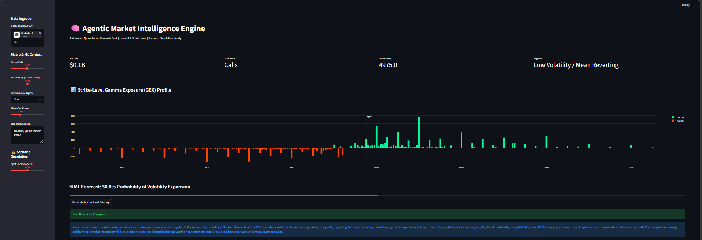

# Market Intelligence Engine 🧠📈
**Agentic AI & Quantitative Research Workflow Automation**



This repository contains a production-grade Market Intelligence Engine designed to automate the daily workflow of a macroeconomic research desk. By integrating quantitative data engineering, machine learning forecasting, and on-premise generative AI orchestration, this system synthesizes raw derivatives data into actionable, client-ready market intelligence briefs.

## 🏗️ System Architecture

The engine operates on a three-tier architecture:

1. **The Quantitative Data Pipeline (`pandas`, `numpy`)**
   - Ingests raw, institutional-grade options chain data (CSV).
   - Computes complex intraday risk metrics, specifically **Net Gamma Exposure (GEX)**, to identify dealer positioning and implied market volatility.
   - Dynamically calculates the **Zero Gamma Level (Gamma Flip)** using a strict liquidity window, identifying the exact strike price where market makers transition from volatility suppression to acceleration.

2. **The Predictive ML Model (`scikit-learn`)**
   - Utilizes a `RandomForestClassifier` trained on historical GEX, VIX, and macroeconomic sentiment data.
   - Incorporates **Historical Regime Memory** (Markov-inspired transition probabilities based on VIX velocity and T-1 regimes).
   - Outputs a statistical probability forecasting the daily market regime (High Volatility Trend vs. Mean-Reverting Chop).

3. **The Agentic Reasoning Loop (LangGraph, Ollama/Llama 3)**
   - Orchestrates a multi-agent workflow (Quant Analyst, Macro Economist, Head of Research).
   - Executes entirely **on-premise** via Ollama to ensure strict data privacy and model risk governance.
   - Synthesizes the data into a cohesive, professional intraday research thesis utilizing programmatic, deterministic guardrails to prevent LLM financial hallucination.

## 🛠️ Tech Stack
* **Data Engineering:** Python, Pandas, NumPy
* **Machine Learning:** Scikit-Learn, Joblib
* **Agentic AI:** LangGraph, LangChain, Ollama (Llama 3 8B)
* **Frontend/Visualization:** Streamlit, Plotly
* **Environment:** Executed locally for enterprise data security.

## 🚀 Key Features
* **Automated Workflow Modernization:** Replaces manual data aggregation and thesis drafting with an intelligent, autonomous pipeline.
* **Microstructure Visualization:** Renders dynamic Plotly charts highlighting Call/Put walls and critical pinning levels.
* **Scenario Simulation Engine:** Allows users to stress-test the market by injecting a hypothetical spot price shock, forcing the math, the ML model, and the AI agents to dynamically recalculate and draft an emergency thesis.

## ⚙️ Installation & Execution

**Prerequisites:** Ensure you have Python 3.9+ installed and the [Ollama engine](https://ollama.com/) running locally with the Llama 3 model pulled (`ollama run llama3`).

```bash
# 1. Clone the repository
git clone (https://github.com/padmabhushanpagare/market_intelligence_engine.git)
cd market_intelligence_engine
```
# 2. Install dependencies
```bash
pip install -r requirements.txt
```
# 3. Setup Data

Place your institutional options chain CSV (must contain strike_price, option_type, open_interest, gamma, active_underlying_price) in the root directory.

# 4. Train the ML Model
```bash
python ml_regime_model.py
```
# 5. Launch the Dashboard
```
streamlit run app.py
```

## 🗺️ Future Roadmap: Institutional Scaling

This engine is architected for continuous deployment. Future iterations will focus on transitioning from a local prototype to an enterprise-grade proprietary trading asset:

- [ ] **Live OPRA WebSocket Streaming:** Transitioning from static CSV ingestion to live data feed integration (via Databento or Polygon.io) for real-time, millisecond-level GEX and Gamma Flip recalculations.
- [ ] **RAG-Powered Macro Intelligence:** Implementing a LangChain + Pinecone Vector Database pipeline to autonomously scrape, chunk, and embed live Federal Reserve press releases and Bloomberg wire headlines directly into the Macro Agent's context window.
- [ ] **Cross-Asset Risk Modeling:** Expanding the machine learning feature set to ingest and correlate parallel options chains from fixed income (TLT), high-yield credit (HYG), and volatility (VIX) products for a holistic regime forecast.
- [ ] **Quantitative Backtesting Engine:** Integrating `vectorbt` to historically backtest the statistical edge, Sharpe ratio, and max drawdown of the AI's daily regime predictions against actual SP500 returns.
- [ ] **Cloud-Native GPU Deployment:** Full Docker/Kubernetes containerization, migrating the local Ollama LLM to dedicated cloud GPUs (AWS/GCP) using `vLLM` for high-throughput, multi-tenant execution.